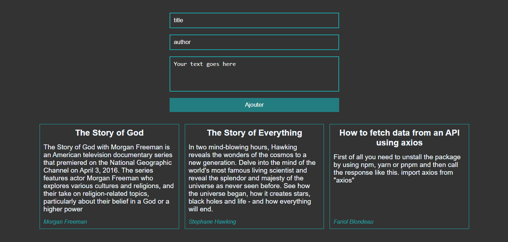

## FullStack app using MongoDB, NodeJS and ReactJS



<hr>
To Try the app you need to install some dependencies.


First of all you need to clone the repository using the <code>https</code>, <code>SSH</code> if you have the key, download the <code>ZIP</code> or open directly with <code>GitHub Desktop</code> :

<code>https</code>
```
git clone https://github.com/bruxx-6243/FullStack-Post-App.git
```
<code>SSH</code>

```
git clone git@github.com:bruxx-6243/FullStack-Post-App.git
```

Next got to direcly of the server /post/server and run:
``` npm sart ``` 
The server will start on port ```5000```

Then go the directly of the client /post/client and run: ```npm install ```, and ```npm run dev``` 
The client side will start on port ```3000```

```NB:``` Here we're using <a href="https://vitejs.dev/">Vite</a> for the frontend
